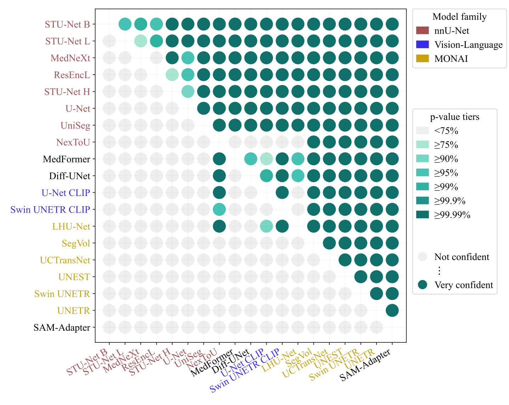
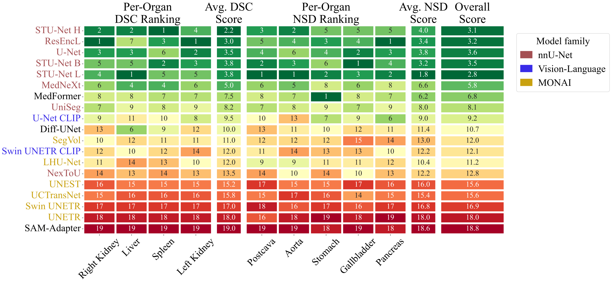
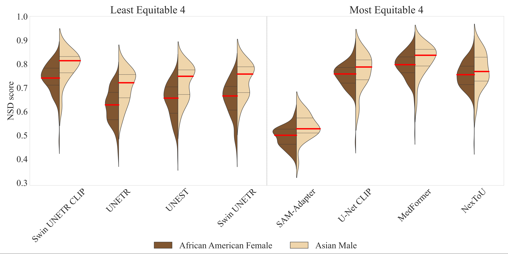

## Tool to analyze Medical AI Benchmarks

1. Significance Map of AI Model Rankings - `src/medical-benchmark-analysis/challengeR_eda.ipynb`

   
2. Models Ranked by appropriate choice of Dice Similarity Coefficient & Normalized Surface Distance - `src/medical-benchmark-analysis/python_eda.ipynb`

3. Demographic Parity Measures - `src/medical-benchmark-analysis/python_eda.ipynb`

